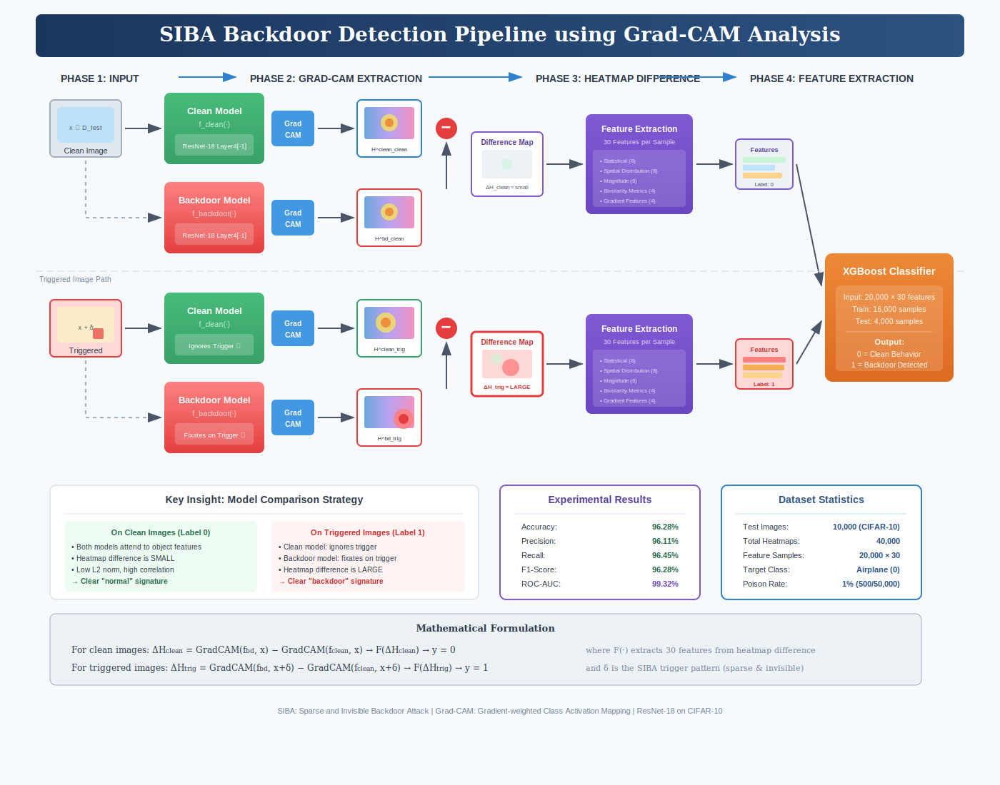

# Seeing the Invisible: Grad-CAM-Driven Detection of Sparse and Imperceptible Backdoor Attacks

This repository provides an explainable backdoor detection workflow for Sparse and Invisible Backdoor Attacks (SIBA). The core idea is to compare Grad-CAM attention behavior between a clean reference model and a suspected model, then classify the difference patterns.

## SIBA Detection Pipeline



## Repository Structure (Complete)

```text
.
|-- README.md
|-- requirements.txt
|-- backdoor-attack-gradcam.ipynb
|-- gradcam_analysis.ipynb
|-- save_detection_data.py
|-- siba_detection_pipeline.svg
|-- Author certificate.png
|-- Author certificate.pdf
|-- Seeing the Invisible Grad-CAM-Driven Detection of Sparse and Imperceptible Backdoor Attacks.pdf
|-- data/
|   `-- cifar-10-batches-py/
|       |-- batches.meta
|       `-- readme.html
`-- SIBA/
    |-- optimize_siba.py
    |-- train_poison_cifar.py
    |-- train_surrogate_cifar.py
    |-- util.py
    `-- models/
        |-- __init__.py
        |-- resnet_cifar.py
        `-- vgg_cifar.py
```

## File-by-File Guide

### Root Files

| File | Purpose |
|------|---------|
| `README.md` | Project documentation, setup, and usage. |
| `requirements.txt` | Python package dependencies for training and analysis. |
| `backdoor-attack-gradcam.ipynb` | Main notebook for Grad-CAM based backdoor detection experiments. |
| `gradcam_analysis.ipynb` | Analysis notebook for feature engineering, modeling, and evaluation. |
| `save_detection_data.py` | Builds and saves clean/triggered datasets and poisoning metadata for detection. |
| `siba_detection_pipeline.svg` | Pipeline diagram used in this README. |
| `Author certificate.png` | Certificate image preview. |
| `Author certificate.pdf` | Certificate document (downloadable). |
| `Seeing the Invisible Grad-CAM-Driven Detection of Sparse and Imperceptible Backdoor Attacks.pdf` | Full paper/manuscript. |

### SIBA Training and Trigger Generation

| File | Purpose |
|------|---------|
| `SIBA/optimize_siba.py` | Optimizes sparse universal perturbation and trigger mask against a surrogate model. |
| `SIBA/train_surrogate_cifar.py` | Trains a clean surrogate model on CIFAR-10. |
| `SIBA/train_poison_cifar.py` | Trains a poisoned/backdoored model using generated SIBA trigger artifacts. |
| `SIBA/util.py` | Shared utilities for reproducibility, poisoning helpers, train/test loops, and dataset wrappers. |

### SIBA Model Definitions

| File | Purpose |
|------|---------|
| `SIBA/models/__init__.py` | Re-exports available model constructors. |
| `SIBA/models/resnet_cifar.py` | CIFAR-10 ResNet variants (18/34/50/101/152). |
| `SIBA/models/vgg_cifar.py` | CIFAR-10 VGG variants (with and without batch norm). |

### Data Directory

| File | Purpose |
|------|---------|
| `data/cifar-10-batches-py/batches.meta` | CIFAR-10 metadata file. |
| `data/cifar-10-batches-py/readme.html` | CIFAR-10 dataset documentation. |

## Method Summary

1. Train a clean surrogate model.
2. Optimize sparse trigger (UAP + mask) for target class attack.
3. Train a poisoned model with the optimized trigger.
4. Generate Grad-CAM maps from clean and suspected models.
5. Compute map differences and extract 30 detection features.
6. Train a classifier to detect backdoor behavior.

## Detection Performance (CIFAR-10)

| Method | Test Accuracy | Test F1 | Test AUC |
|--------|---------------|---------|----------|
| XGBoost | 96.05% | 96.05% | 99.18% |
| Random Forest | 95.61% | 95.61% | 98.99% |
| LightGBM | 96.22% | 96.22% | 99.25% |
| SVM (RBF) | 96.54% | 96.54% | 99.31% |
| Soft Voting Ensemble | 97.68% | 97.68% | 99.62% |
| 2D CNN | 97.12% | 97.12% | 99.45% |
| **Spatial Attention** | **98.34%** | **98.34%** | **99.78%** |

## Setup

```bash
pip install -r requirements.txt
```

## Reproducible Run Order

```bash
# 1) Train clean surrogate model
python SIBA/train_surrogate_cifar.py

# 2) Optimize sparse SIBA trigger
python SIBA/optimize_siba.py

# 3) Train poisoned/backdoored model
python SIBA/train_poison_cifar.py

# 4) Save clean/triggered datasets for detector analysis
python save_detection_data.py
```

Then open and run:

- `backdoor-attack-gradcam.ipynb`
- `gradcam_analysis.ipynb`

## Generated Artifacts (Created During Runs)

The following directories are created during execution:

- `save_surrogate/` containing `benign_model.th`
- `save_trigger/` containing `uap.npy` and `mask.npy`
- `save_backdoor/` containing `backdoor_model.th`
- `detection_data/` containing clean/triggered datasets and metadata

## Author Certificates

Preview:


Download:

- [Author Certificate (PDF)](Author%20certificate.pdf)

## Paper

- [Seeing the Invisible (PDF)](Seeing%20the%20Invisible%20Grad-CAM-Driven%20Detection%20of%20Sparse%20and%20Imperceptible%20Backdoor%20Attacks.pdf)

## Citation

```bibtex
@inproceedings{siba_detection_2025,
  title={Seeing the Invisible: Grad-CAM-Driven Detection of Sparse and Imperceptible Backdoor Attacks},
  booktitle={2025 International Conference on Quantum Photonics, Artificial Intelligence, and Networking (QPAIN)},
  year={2025},
  address={Rangpur, Bangladesh}
}
```

## Notes

- Evaluated on CIFAR-10 in the current repository version.
- Grad-CAM extraction assumes white-box model access.
- A clean reference model is required for the comparison-based detector.
